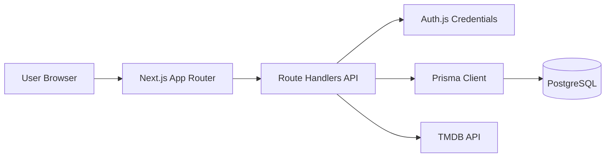

# Suggest App 設計書

最終更新: 2026-04-21  
対象リポジトリ: `suggest-app`  
目的: 本ドキュメントを外部AI（Claude等）に渡し、仕様理解・改善提案・実装相談の共通土台にする。

---

## 1. プロダクト概要

「今夜観る映画」を短時間で決めるための推薦アプリ。

- 推薦件数は最大3件（本命1 + バックアップ最大2）
- 理由は短く明快に表示（1〜3理由）
- ユーザーの初期嗜好はオンボーディングで収集
- 推薦時は気分・視聴文脈・尺・コンテンツ注意タグを反映

---

## 2. 技術スタック

- Frontend: Next.js 16 App Router, React 19, TypeScript, Tailwind CSS
- Auth: Auth.js (next-auth v5 beta), Credentials Provider
- DB/ORM: PostgreSQL, Prisma
- Validation: Zod
- Password: bcryptjs

---

## 3. システム構成



補足:
- 認証必須APIは `requireUser()` を通してガード
- 推薦ロジックは `src/lib/recommendation/engine.ts` に集約
- 外部データは主にTMDB（候補補完・人物情報・ポスター厳密照合）

---

## 4. 認証設計

### 4.1 ログイン方式
- Credentials認証（`email + username + password`）
- セッション戦略は JWT
- サインインページは `/login`

### 4.2 実装ファイル
- `src/auth.ts`: NextAuth設定本体
- `src/app/api/auth/[...nextauth]/route.ts`: Auth handler公開
- `src/lib/auth/require-user.ts`: API用の認証ガード

---

## 5. 主要画面とユーザーフロー

### 5.1 画面一覧
- `/` ランディング
- `/login` ログイン/登録
- `/onboarding` 初期嗜好入力（MBTI + スワイプ + 既知作品評価）
- `/profile/taste` 味覚プロファイル表示 + ランキング導線
- `/mypage` 嗜好の継続調整（ジャンル/監督/俳優/発見モード）
- `/recommend` 推薦条件入力
- `/recommend/result/[sessionId]` 推薦結果表示
- `/history`, `/settings`

### 5.2 主要フロー
1. ログイン
2. オンボーディング送信 (`POST /api/onboarding`)
3. Taste Profile生成
4. 推薦入力送信 (`POST /api/recommendations`)
5. 推薦結果確認 + フィードバック (`POST /api/feedback`)

---

## 6. ドメインモデル（DB設計）

スキーマ基準: `prisma/schema.prisma`

### 6.1 コアエンティティ
- `User`: 認証情報とマイページ嗜好
- `UserPreference`: 入力された嗜好（artists/movies/moods/dislikes）
- `UserTasteProfile`: 推薦に使うベクトル化済みプロファイル
- `Movie`: 推薦対象カタログ（タグ、監督、俳優、スコア等）
- `RecommendationSession`: 推薦実行コンテキストの保存
- `RecommendationResult`: セッション内の順位付き結果
- `FeedbackLog`: 推薦結果への反応ログ

### 6.2 オンボーディング拡張
- `UserOnboardingProfile`: MBTI/バージョン
- `UserMovieSwipe`: known/unknown + liked/skipped + rating
- `UserWatchedMovie`: 視聴済みとして蓄積（source付き）

### 6.3 補助エンティティ
- `MovieAvailability`: 配信可用性
- `PersonProfileCache`: 監督/俳優プロフィールのキャッシュ

---

## 7. API設計（現行）

### 7.1 認証/ユーザー
- `GET /api/me`: セッションユーザー情報
- `GET|POST /api/auth/[...nextauth]`: 認証

### 7.2 オンボーディング
- `POST /api/onboarding`: オンボーディング保存 + Taste Profile生成
- `GET /api/onboarding/swipe-candidates`: スワイプ候補取得
- `POST /api/onboarding/swipe-events`: スワイプイベント保存

### 7.3 推薦
- `POST /api/recommendations`: 推薦実行
- `GET /api/recommendations/[sessionId]`: セッション結果取得
- `POST /api/feedback`: 反応ログ保存

### 7.4 プロファイル/設定
- `GET /api/taste-profile`: 最新Taste Profile取得
- `POST /api/taste-profile/rebuild`: 再構築
- `GET|POST /api/mypage/preferences`: マイページ嗜好取得/更新
- `GET /api/profile/rankings`: 視聴蓄積による監督/俳優ランキング

### 7.5 カタログ/外部連携
- `GET /api/movies/search`
- `GET /api/movies/suggestions`
- `GET /api/people/[name]`
- `POST /api/admin/catalog/sync`

---

## 8. 入力バリデーションと語彙統制

主要ファイル:
- `src/lib/validation/schemas.ts`
- `src/lib/constants/taxonomy.ts`

### 8.1 バリデーション原則
- Onboarding Fast Path:
  - `mbtiType` 必須
  - `swipeEvents` は3〜60件
  - knownはrating必須、unknownはrating禁止
  - movieIdの重複偏りをチェック
- Recommendations:
  - `desiredRuntimeMin <= desiredRuntimeMax`
  - スコア関連は仕様範囲内（例: `minimumReviewScore 0..10`）

### 8.2 語彙統制
ムード、視聴文脈、content warnings、genre、feedback reactionなどは定数配列を単一ソースとして利用。

---

## 9. 推薦ロジック

実装: `src/lib/recommendation/engine.ts`

### 9.1 処理ステップ
1. 入力から `ContextVector` を構築
2. カタログをフィルタ（尺、除外警告、除外タグ、除外ジャンル、レビュー閾値）
3. 各映画をスコアリング
4. 上位3件を返却（rank 1..3）
5. 理由文を生成（重複回避）

### 9.2 スコア要素（概略）
- mood match
- context match
- runtime fit
- style match
- favorite/excluded genre補正
- preferred director/actor補正
- review補正

---

## 10. Taste Profile生成ロジック

実装: `src/lib/taste-profile/buildTasteProfile.ts`

- 入力: favorite artists/movies, preferred moods, disliked elements, MBTI, swipe insights
- 出力:
  - mood/tone/pace/complexity等の連続値ベクトル
  - runtime tolerance
  - summary
  - metadata（推論根拠）

MBTIごとにスタイル補正値を持ち、スワイプ比率（liked/known）で微調整する設計。

---

## 11. オンボーディング候補取得設計

実装: `src/app/api/onboarding/swipe-candidates/route.ts`

- 映画カタログからプール抽出（上限あり）
- ランダムサンプリングで候補化
- 概要が短い候補のみTMDB補完（上限件数あり、並列化）
- ポスター欠損時は `/images/no-poster.svg` を返す
- タイトル照合は Unicode正規化 (`NFKC`) + Unicode文字クラスで正規化

---

## 12. 非機能要件（現状）

### 12.1 UX
- Step2スワイプUIは単一カード表示で操作
- PC/モバイル双方を想定した pointer events ベース実装

### 12.2 性能
- スワイプ移動更新はrAF集約
- 候補APIはTMDB補完を制限して初期待ちを短縮

### 12.3 品質
- `npm run lint`
- `npm run build`
- Prisma Client生成を運用手順に含む

---

## 13. 既知のリスク / 改善候補

- Step2のUIチューニングは継続中（文字量・画面幅での見え方最適化）
- IDE診断と実ビルドで型表示がズレるケースがある（Prisma生成/IDE再同期前提）
- 推薦ロジックはルールベース中心のため、将来的な学習ベース化余地あり

---

## 14. 今後の拡張案（Claude相談向け）

1. **Recommendation品質**
   - スコア重みの自動最適化（反応ログを使ったweight tuning）
   - cold start時の多様性制御
2. **データ品質**
   - 映画メタデータの同期パイプライン強化
   - 人物照合の信頼度スコア改善
3. **UI/UX**
   - Step2の視覚フィードバック最適化
   - オンボード完了率の計測ダッシュボード
4. **分析基盤**
   - 推薦セッション/反応ログのDWH連携
   - KPI: completion rate, rec acceptance rate, time-to-first-play

---

## 15. Claudeへ渡すときの推奨プロンプト

以下を併用すると改善提案の質が上がる。

```text
この設計書は現行実装に基づく映画推薦アプリの仕様です。
目的は「Step2 UXの安定化」と「推薦品質向上」です。
以下を提案してください:
1) 現行設計のボトルネック3点
2) 影響小の改善案（1週間）
3) 中期改善案（1-2ヶ月）
4) API/DB変更が必要な場合の移行戦略
5) 実装優先順位（根拠つき）
```

